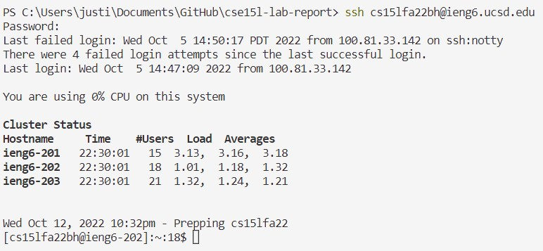

# Week 1 Lab Report
## Installing VSCode
1. To install VSCode, visit this [download link](https://code.visualstudio.com/download). It should send you to this page below, and you should download whichever version that is compatible with your device. I'm currently working on a Windows system, so this tutorial will be catered toward that!


2. After installing the file to your computer, launch the file and it should proceed to setup VSCode on your device. I already have VSCode installed onto my laptop prior to this, so I cannot assist with this part. As for a reference, this is what my program looks like when I launch it.


## Remotely Connecting
1. In order to make sure you can access your course-specific account, you need to install the OpenSSH client onto your device if you have a Windows.
    * First, open up your Settings on Windows and navigate to the Apps section.
    * Then, go to the Optional features section and search up "OpenSSH Client" into the search bar to check if you have it installed. 
    * If it doesn't show up, click on the "View Features" button next to "Add an optional feature", search up "OpenSSH Client", and install. This is done correctly if "OpenSSH Client" shows up under the installed features portion.
    
2. Open up VSCode and launch the terminal by either going under the Terminal tab -> New Terminal or using the command (Ctrl + Shft + `). In the terminal, type in the following command with your course-specific account. I am using my course-specific account as an example below.
    * note that the only varying element of the format is cs15lfa22__@ieng6.ucsd.edu
```
ssh cs15lfa22bh@ieng6.ucsd.edu
```
3. The terminal will prompt you to enter the password which should be the one that you chose when you reset your password. A successful login will look like this:


## Running Some Commands
Going through some of the 


## Resetting my Password + Issues
* This is me logging into the website.

    

* As you can see, both my AD and my course-specific account passwords have been updated about 40 minutes ago now. This has been my 5-6th time resetting my password for the past 3 days without it working on the terminal. To note, I also have no issues logging into Canvas/Tritonlink with my new passwords.
        
        
        

* This is what it looks like in the terminal. I have been copying and pasting my password as well as typing it out in the terminal. Both have not been working.

    

* I have also tried using my AD username and password which also does not work. 
    

As of right now, I cannot complete the rest of the lab due to the fact that my account isn't working. I plan on attending one of the office hours next week in order to get further assistance on this issue!